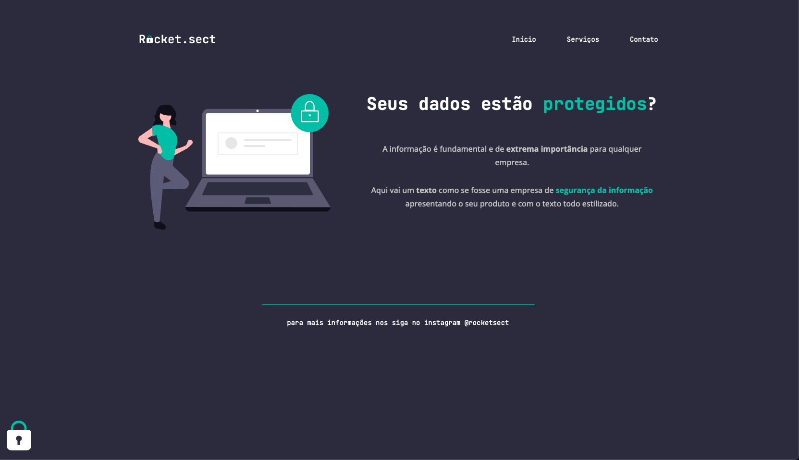

# Desafio avançado - Recriando layout

> Desafio proposto no Stage 02 do Explorer da Rocketseat

# Sobre o desafio

Nesse desafio, você deverá recriar uma aplicação, a partir de um layout, para treinar o que aprendeu até agora no Stage 02.

# Instrutores

<table>
   <thead>
      <tr>
         <td valign="bottom">
            

               
            

         </td>
         <td valign="bottom">
            

               
            

         </td>
				 <td valign="bottom">
            

               
            

         </td>
				 <td valign="bottom">
            

               
            

         </td>
      </tr>
   </thead>
   <tbody>
      <tr>
         <td><a href="https://github.com/birobirobiro">João Inácio</a></td>
         <td><a href="https://github.com/larazevedo">Lara Azevedo</a></td>
         <td><a href="https://github.com/tfstam">Tamires Santos</a></td>
         <td><a href="https://github.com/anasilveira9787">Ana Silveira</a></td>
      </tr>
   </tbody>
</table>
